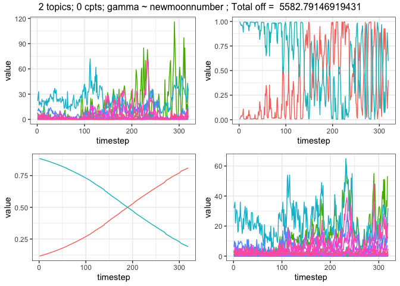
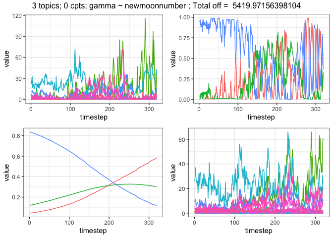
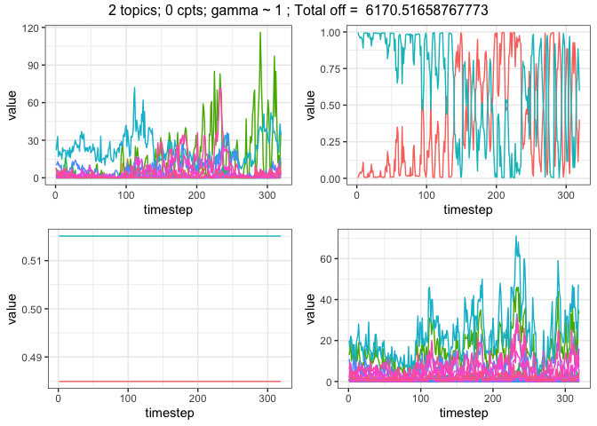
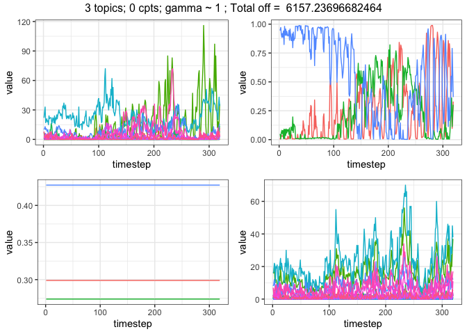
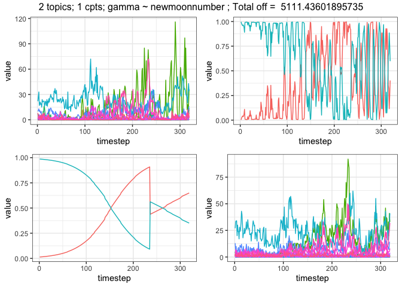
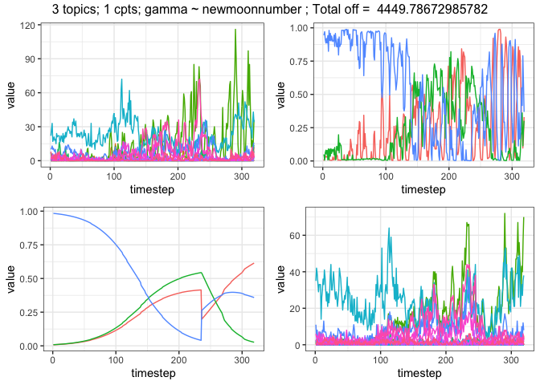
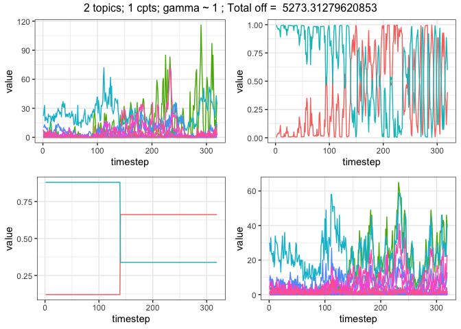
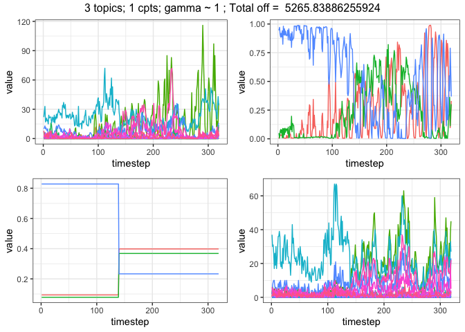

Playing with LDA\_TS fits
================
Renata Diaz
7/26/2019

``` r
dat <- get_portal_rodents()
```

``` r
dat_lda <- matssldats::run_LDA(data = dat, max_topics = 3, nseeds = 1)
```

``` r
dat_ts <- matssldats::run_TS(data = dat,ldamodels = dat_lda, nchangepoints = c(0, 1), 
                             weighting = "proportional", control = list(nit = 100))
```

``` r
load(here::here("analysis", "reports", "toy_ldats_stash", "toy_ldats_stash.RData"))
source(here::here("analysis", "reports", "toy_ldats.R"))
```

``` r
for(i in 1:length(dat_lda)) {
    plot(dat_lda[[i]])
    
    ntopics <- dat_lda[[i]]@k
    
    for(j in 1:length(dat_ts)) {
        ts_topics <- ncol(dat_ts[[j]]$data$gamma)
        if(ts_topics == ntopics) {
            plot(dat_ts[[j]])
        }
    }
}
```

``` r
pred_vals_1 <- get_fitted_proportions(dat_ts[[1]])    
abund <- get_fitted_abundances(pred_vals_1, dat_lda[[1]], dat$abundance)
total_off <- get_total_off(abund, dat$abundance)
```

``` r
lda_ntopics <- list()
for(i in 1:length(dat_lda)) {
    lda_ntopics[[i]] <- dat_lda[[i]]@k
}
lda_ntopics <- as.integer(unlist(lda_ntopics))


ts_lda_pairs <- list()
for(i in 1:length(dat_ts)) {
    this_ts <- dat_ts[[i]]
    ts_ntopics <- as.integer(unlist(substr(names(dat_ts)[i], 4, 4)))
    this_lda <- dat_lda[[ which(lda_ntopics == ts_ntopics)]]
    ts_lda_pairs[[i]] <- list(lda = this_lda, ts = this_ts)
}

predicted_abundances <- list()

for(i in 1:length(ts_lda_pairs)) {
    this_pred_vals <- get_fitted_proportions(ts_lda_pairs[[i]]$ts)
    this_pred_abund <- get_fitted_abundances(this_pred_vals, ts_lda_pairs[[i]]$lda, dat$abundance)
    predicted_abundances[[i]] <- list(ts = ts_lda_pairs[[i]]$ts,
                                      lda = ts_lda_pairs[[i]]$lda,
                                      pred_prop = this_pred_vals,
                                      pred_abund = this_pred_abund,
                                      how_far_off = data.frame(
                                          total_off = get_total_off(this_pred_abund, dat$abundance),
                                          ntopics = ts_lda_pairs[[i]]$lda@k,
                                          nchangepoints = ts_lda_pairs[[i]]$ts$nchangepoints,
                                          formula = deparse(ts_lda_pairs[[i]]$ts$formula)
                                      )
    )
}
```

``` r
library(ggplot2)

true_abund <- dat$abundance
colnames(true_abund) <- 1:ncol(true_abund) 
true_abund <- true_abund %>%
    dplyr::mutate(timestep = 1:nrow(true_abund)) %>%
    reshape2::melt(id = "timestep") %>%
        dplyr::mutate(variable = as.character(variable))

true_abund_plot <- ggplot(data = true_abund, aes(x = timestep, y = value, color = variable)) +
    geom_line() +
    theme_bw() + theme(legend.position = "none")

for(i in 1:length(predicted_abundances)) {

lda_data <- predicted_abundances[[i]]$lda@gamma %>%
    as.data.frame() %>%
    dplyr::mutate(timestep = 1:nrow(dat$abundance)) %>%
    reshape2::melt(id = "timestep")

lda_plot <- ggplot(data = lda_data, aes(x = timestep, y = value, color = variable)) + 
    geom_line() + 
    theme_bw() + theme(legend.position = "none")

pred_prop_data <- predicted_abundances[[i]]$pred_prop %>%
    as.data.frame() %>%
    dplyr::mutate(timestep = 1:nrow(dat$abundance)) %>%
    reshape2::melt(id = "timestep")

pred_prop_plot <- ggplot(data = pred_prop_data, aes(x = timestep, y = value, color = variable)) + 
    geom_line() + 
    theme_bw() + theme(legend.position = "none")

pred_vals_data <- predicted_abundances[[i]]$pred_abund %>%
    dplyr::mutate(timestep = 1:nrow(predicted_abundances[[i]]$pred_abund)) %>%
    reshape2::melt(id = "timestep") %>%
    dplyr::mutate(variable = as.character(variable))

pred_vals_plot <- ggplot(data = pred_vals_data, aes(x = timestep, y = value, color = variable)) + 
    geom_line() + 
    theme_bw() + theme(legend.position = "none")

gridExtra::grid.arrange(grobs = list(true_abund_plot,
                                     lda_plot,
                                     pred_prop_plot,
                                     pred_vals_plot),
                        nrow = 2, top = paste(predicted_abundances[[i]]$how_far_off$ntopics, "topics;",
                                             predicted_abundances[[i]]$how_far_off$nchangepoints, "cpts;",
                                              predicted_abundances[[i]]$how_far_off$formula, 
                                              "; Total off = ",
                                              predicted_abundances[[i]]$how_far_off$total_off))
}
```


