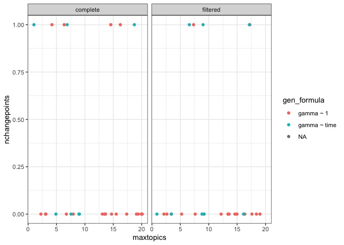
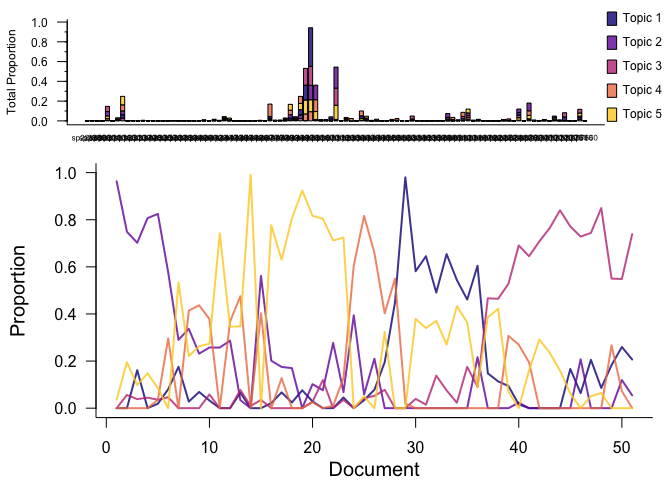
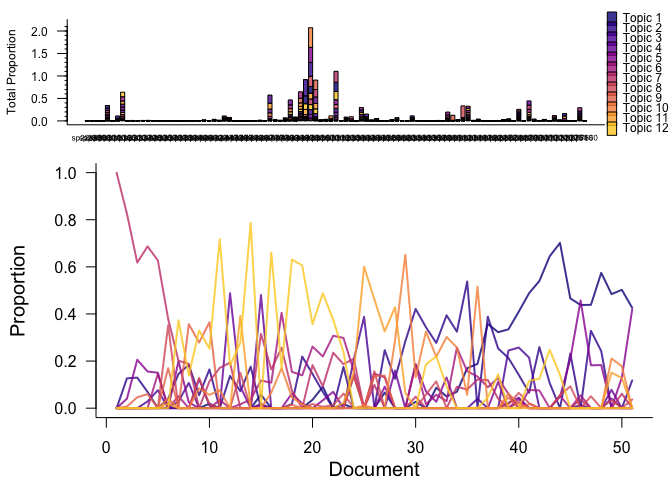
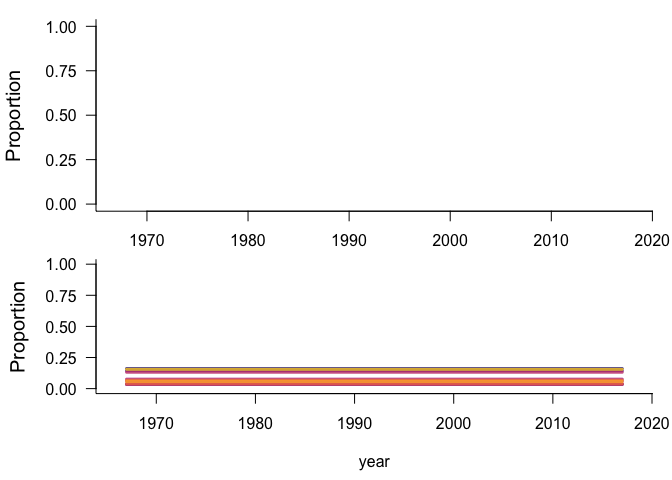

TS on LDA report
================
Renata Diaz
10/12/2018

Read in the results
-------------------

``` r
# define where the cache is located
db <- DBI::dbConnect(RSQLite::SQLite(), here::here("drake", "drake-cache.sqlite"))
cache <- storr::storr_dbi("datatable", "keystable", db)

ts_results <- readd(ts_results, cache = cache)

selected_ts_results <- readd(ts_select_results, cache = cache)
```

Errors
------

Find TS models that threw errors while running and remove them:

These TS models ran successfully:

Find TS models that threw errors in selection and remove them:

These TS models were selected correctly:

Community-level results
-----------------------

Cross-community results
-----------------------

``` r
plot(lda_ts_result_summary$ntopics, lda_ts_result_summary$nchangepoints, 
     main = 'Number of changepoints by number of LDA topics', 
     xlab = 'Number of LDA topics', ylab = 'Number of changepoints')
```


``` r
plot(lda_ts_result_summary$ntimesteps, lda_ts_result_summary$nchangepoints, 
     main = 'Number of changepoints by length of timeseries', 
     xlab = 'Length of timeseries (number of timesteps)', ylab = 'Number of changepoints')
```


Detailed model results
----------------------


``` r
lda_ts_result_summary$filtered_topics <- paste(lda_ts_result_summary$filtered, 
                                               lda_ts_result_summary$topics,
                                               sep= "_")

ncpts_lot <- ggplot(data = lda_ts_result_summary, aes(x = maxtopics, y = nchangepoints, color = gen_formula)) +
 geom_jitter(height = 0) +
    theme(legend.position = "none")  +
    theme_bw() +
  facet_wrap(facets = filtered ~ .)
ncpts_lot
```

    ## Warning: Removed 8 rows containing missing values (geom_point).



``` r
lda_select_lda_bbs_data_rtrg_1_11_5 <- readd(lda_select_lda_bbs_data_rtrg_1_11_5, cache = cache)
plot(lda_select_lda_bbs_data_rtrg_1_11_5)
```



    ## $`k: 5, seed: 122`
    ## NULL

``` r
ts_select_ts_bbs_data_rtrg_1_11_lda_select_lda_bbs_data_rtrg_1_11_5 <- readd(ts_select_ts_bbs_data_rtrg_1_11_lda_select_lda_bbs_data_rtrg_1_11_5, cache = cache)
plot(ts_select_ts_bbs_data_rtrg_1_11_lda_select_lda_bbs_data_rtrg_1_11_5)
```


``` r
lda_select_lda_bbs_data_rtrg_1_11_16 <- readd(lda_select_lda_bbs_data_rtrg_1_11_16, cache = cache)
plot(lda_select_lda_bbs_data_rtrg_1_11_16)
```



    ## $`k: 12, seed: 4`
    ## NULL

``` r
ts_select_ts_bbs_data_rtrg_1_11_lda_select_lda_bbs_data_rtrg_1_11_16 <- readd(ts_select_ts_bbs_data_rtrg_1_11_lda_select_lda_bbs_data_rtrg_1_11_16, cache = cache)
plot(ts_select_ts_bbs_data_rtrg_1_11_lda_select_lda_bbs_data_rtrg_1_11_16)
```



``` r
# lda_ts_result_summary$data_name <- vapply(lda_ts_result_summary$ts_name,
#                                           get_data_names,
#                                           FUN.VALUE = "maizuru_data")
# lda_ts_result_summary$filtered <- vapply(lda_ts_result_summary$ts_name,
#                                          get_filtered,
#                                          FUN.VALUE = "filtered")
# lda_ts_result_summary <- lda_ts_result_summary %>%
#     dplyr::mutate(filtered_topics = paste(filtered, maxtopics, sep = "_"))
# 
# nb_topics_plot <- ggplot(data = lda_ts_result_summary, aes(x = filtered_topics, y = ntopics)) +
#     geom_point() +
#     theme(legend.position = "none")  +
#     theme_bw() +
#     facet_wrap(facets = data_name ~ .)
```
